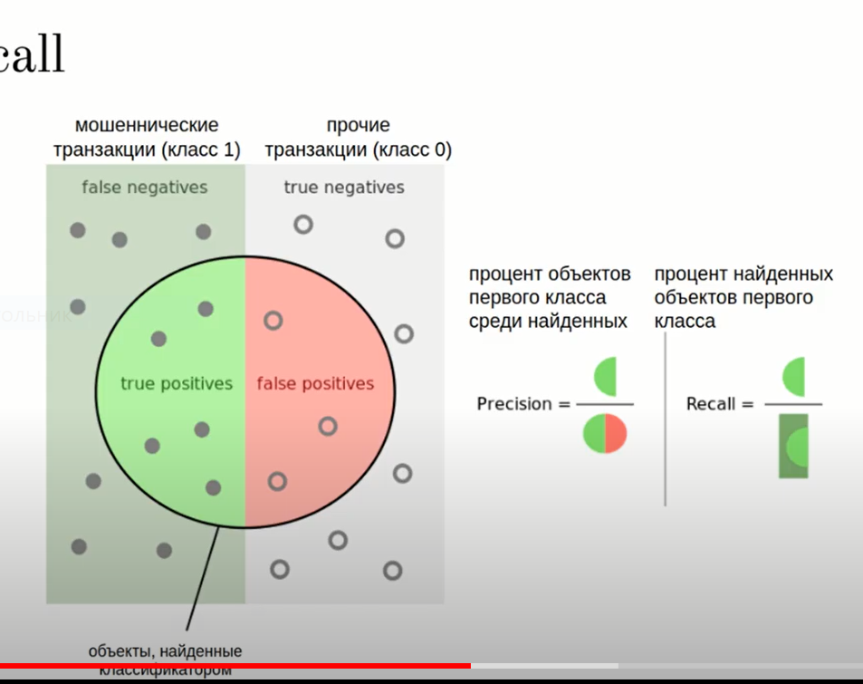

# Metrics and kaggle

## Metrics

Precision - процент объектов первого класа среди найденных классификатором как первый класс

$$\text{Precision} = \frac{\text{true positives}}{\text{false positives} + \text{true positives}}$$

Recall (полнота) - процент найденных объектов 1 класса среди всех объектов первого класса

$$\text{Recall} = \frac{\text{true positives}}{\text{false negative} + \text{true positives}}$$

